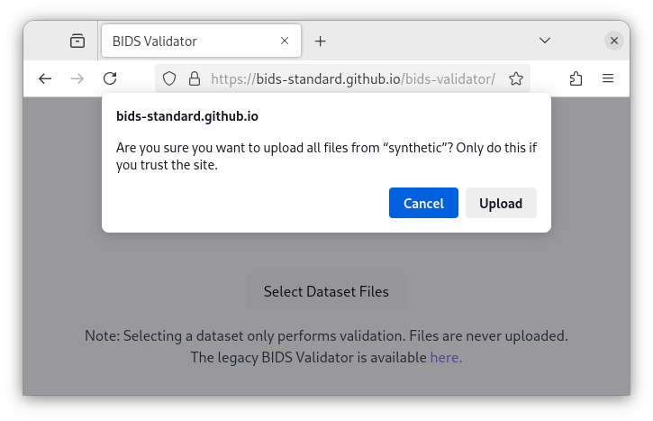
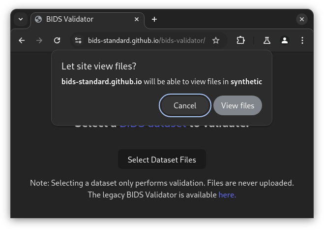
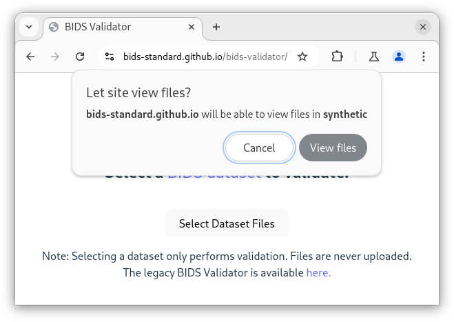

# Using the web validator

The web validator is the primary interface to the validator,
hosted at <https://bids-standard.github.io/bids-validator/>

{.only-dark .no-scaled-link width="50%" align=center}
{.only-light .no-scaled-link width="50%" align=center}

To validate a dataset, click the "Select Dataset Files" and select a directory to validate.
The directory must contain a `dataset_description.json` to be identified as a BIDS dataset.

When you select a directory, you will get a permission prompt,
verifying that you want to provide access to the directory.

::::{tab-set}

:::{tab-item} Firefox permission prompt

{.only-dark width="50%" align=center}
{.only-light width="50%" align=center}

:::
:::{tab-item} Chrome permission prompt
:sync: install

{.only-dark width="50%" align=center}
{.only-light width="50%" align=center}

:::
::::

At present (November 2024), Firefox browsers present the request to "Upload" data,
while Chromium-based browsers (Google Chrome, Microsoft Edge, and others) request permission
to "view files".
In both cases, confirming allows the Javascript application to read the files and perform validation,
but those files are never sent to a remote server.

## The Legacy Validator

The current BIDS Validator is a complete rewrite of the original BIDS Validator,
based on the [BIDS Schema].
The original validator, now called the "legacy validator", can be found at
<https://bids-standard.github.io/legacy-validator/>.

It is not recommended to use this validator, as it will become increasingly out-of-date,
but it may be useful for comparative purposes.

[BIDS Schema]: https://bidsschematools.readthedocs.io
